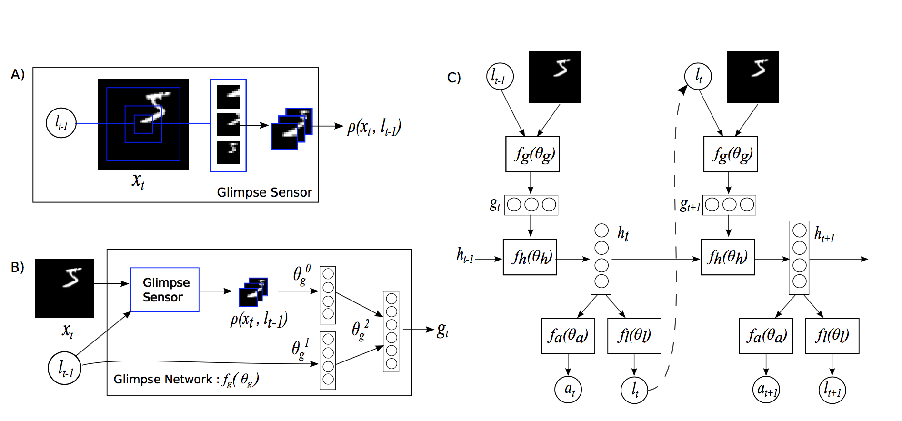
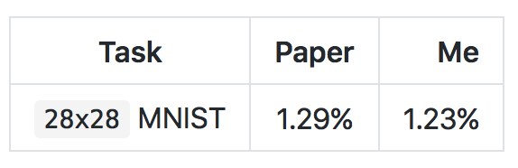
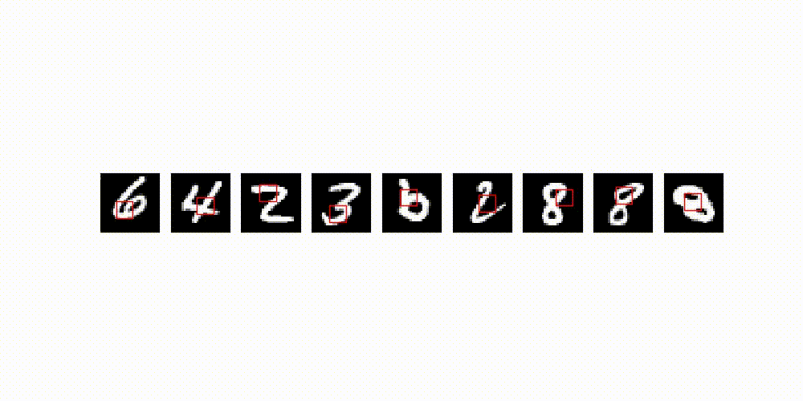

# Recurrent Visual Attention

This is a **PyTorch** implementation of [Recurrent Models of Visual Attention](https://arxiv.org/abs/1406.6247) by *Volodymyr Mnih, Nicolas Heess, Alex Graves and Koray Kavukcuoglu*.

<p align="center">
 
</p>
<p align="center">
 
</p>

The *Recurrent Attention Model* (RAM) is a recurrent neural network that processes inputs sequentially, attending to different locations within the image one at a time, and incrementally combining information from these fixations to build up a dynamic internal representation of the image.

## Model Description

In this paper, the attention problem is modeled as the sequential decision process of a goal-directed agent interacting with a visual environment. The agent is built around a recurrent neural network: at each time step, it processes the sensor data, integrates information over time, and chooses how to act and how to deploy its sensor at the next time step.

<p align="center">
 
</p>

- **glimpse sensor**: a retina that extracts a foveated glimpse `phi` around location `l` from an image `x`. It encodes the region around `l` at a high-resolution but uses a progressively lower resolution for pixels further from `l`, resulting in a compressed representation of the original image `x`.
- **glimpse network**: a network that combines the "what" (`phi`) and the "where" (`l`) into a glimpse feature vector`g_t`.
- **core network**: an RNN that maintains an internal state that integrates information extracted from the history of past observations. It encodes the agent's knowledge of the environment through a state vector `h_t` that gets updated at every time step `t`.
- **location network**: uses the internal state `h_t` of the core network to produce the location coordinates `l_t` for the next time step.
- **action network**: after a fixed number of time steps, uses the internal state `h_t` of the core network to produce the final output classification `y`.

## Results

I decided to tackle the `28x28` MNIST task with the RAM model containing 6 glimpses, of size `8x8`, with a scale factor of `1`.

<p align="center">
 
</p>

I haven't done random search on the policy standard deviation to tune it, so I expect the test error can be reduced to sub `1%` error. I'll be updating the table above with results for the `60x60` Translated MNIST, `60x60` Cluttered Translated MNIST and the new Fashion MNIST dataset when I get the time.

Finally, here's an animation showing the glimpses extracted by the network on a random batch of the 135th epoch.

<p align="center">
 
</p>

## Requirements

- python 3.5+
- pytorch 0.2+
- tensorboard_logger
- tqdm

## Usage

The easiest way to start training your RAM variant is to edit the parameters in `config.py` and run the following command:

```
python main.py
```

To resume training, run the following command:

```
python main.py --resume=True
```

Finally, to test a checkpoint of your model that has achieved the best validation accuracy, run the following command:

```
python main.py --is_train=False
```

## References

- [Torch Blog Post on RAM](http://torch.ch/blog/2015/09/21/rmva.html)