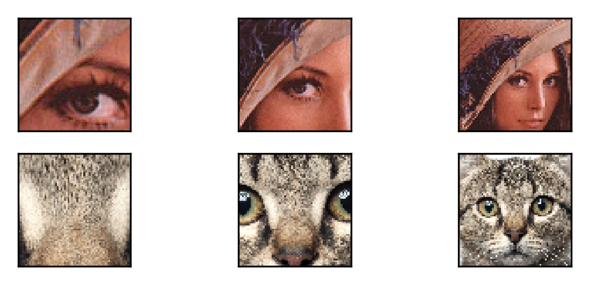
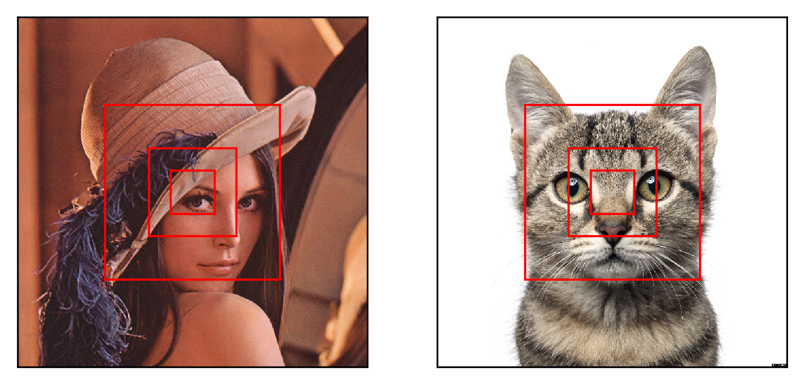

# Recurrent Visual Attention

Work In Progress

 

 

## Todo

- make the patch extraction code vectorized (don't know if possible)

## Notes

- `retina`
    - takes as input an image and a location vector
    - outputs foveated glimpses of this image
- `glimpse network`
    - takes as input an image and a location vector
    - uses the retina
    - feeds output of retina through a fc layer
    - feeds location vector through a fc layer
    - concatenates both and applies nonlinearity
    - outputs a glimpse representation vector
    - trained with backprop
- `core network`
    - takes as input the glimpse representation vector
    - also takes as input the hidden representation at the previous time step
    - basically a 1-layer RNN
    - outputs the hidden representation for the current timestep
    - trained with backprop
- `location network`
    - takes as input the hidden state representation for the current timestep
    - 2 component gaussian with a fixed variance
    - feeds the hidden state through a fc layer to produce 1 output
    - this output is the mean of the location policy at time t
    - the variance is found using random search
    - trained with REINFORCE
- `action network`
    - takes as input the hidden state representation for the current timestep
    - used only at last timestep N
    - linear softmax over the hidden representation
    - divided by a normalizing constant Z
    - train through backprop

## Training

The RAM model uses a non-differentiable attention mechanism. This means we cannot train it through standard backprop. Instead, we use REINFORCE, which allows us to train stochastic units through reinforcement learning.

The RAM model uses the REINFORCE algorithm to train the locator network. The locator network passes the recurrent hidden state through an affine transform to produce a mean. The mean is used to parametrize a normal distribution with a fixed standard deviation (found using random search).

We need to implement `ReinforceNormal` which uses the REINFORCE algorithm for the normal distribution. It uses a reward function to compute `gradInputs` when `backward` is called.

In the paper, the reward function is defined to be `R = I(y=t)` where R is the raw reward, I(x) is 1 and x is true and 0 otherwise, y is the predicted class and t is the target class.

The REINFORCE algorithm requires that we differentiate the probability density function (PDF) of the distribution w.r.t. the parameters. So we find the gradient of the log normal w.r.t to the mean and plug it in the gradient of the reward w.r.t to the mean.

In summary, if we can differentiate the PDF w.r.t to its parameters, then we can use the REINFORCE algorithm on it.